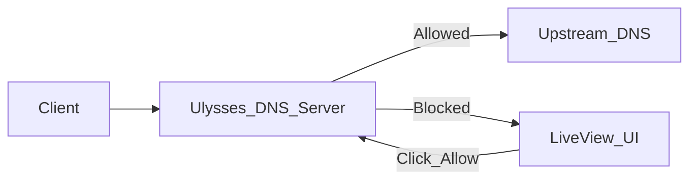

# 🛡️ Ulysses

**Ulysses** is a local DNS firewall and accountability system built with Elixir + Phoenix LiveView. Inspired by the concept of a **Ulysses Pact**—a commitment made in a moment of clarity to constrain future behavior—this tool helps you intentionally control internet access by allowing only whitelisted domains and blocking all others.

It acts as a self-binding agreement to prevent distraction and promote focused, deliberate browsing.

---

## 🎯 Project Goals

- Run a local DNS nameserver via Elixir
- Block all outbound domain requests by default
- Maintain an in-memory whitelist using a `GenServer`
- Allow human-in-the-loop review and approval via a LiveView UI
- Provide visibility into all attempted DNS lookups
- Serve as a digital accountability device

---

## 🧠 Inspiration

The name "Ulysses" comes from the **Ulysses Pact**—a decision made while rational and focused to avoid succumbing to future temptation. Much like Odysseus tying himself to the mast to resist the Sirens, this tool blocks all unknown domains unless explicitly approved.

---

## 🧱 Core Components

- `Ulysses.DomainCache`  
  A GenServer that holds `allowed` and `pending` domain sets in memory.
  
- `Ulysses.DnsServer`  
  A UDP DNS listener using `:gen_udp` and `:inet_dns` that checks the cache, forwards approved queries, and blocks the rest with `NXDOMAIN`.

- `UlyssesWeb.PendingLive`  
  A Phoenix LiveView UI that shows pending domains and allows approval via click.

---

## 🚀 Usage

To use Ulysses as your local DNS firewall, you need to point your system's DNS resolver to the Ulysses DNS server.

### 1. Edit `/etc/resolv.conf`

Add the following line at the top of your `/etc/resolv.conf` file:

```
nameserver 127.0.0.1
```

This tells your system to use the local DNS server (Ulysses) for all DNS lookups.

> **Note:**
> - The Ulysses DNS server listens on port 53 by default. Running a service on port 53 usually requires root/admin privileges.
> - If you want to run Ulysses on a different port, you must also configure your system or use a tool like `dnsmasq` or `systemd-resolved` to forward DNS requests from port 53 to your chosen port.
> - Some systems automatically overwrite `/etc/resolv.conf` on reboot or network changes. For persistent changes, consult your OS documentation.

---

## 📐 System Diagram (Mermaid)


